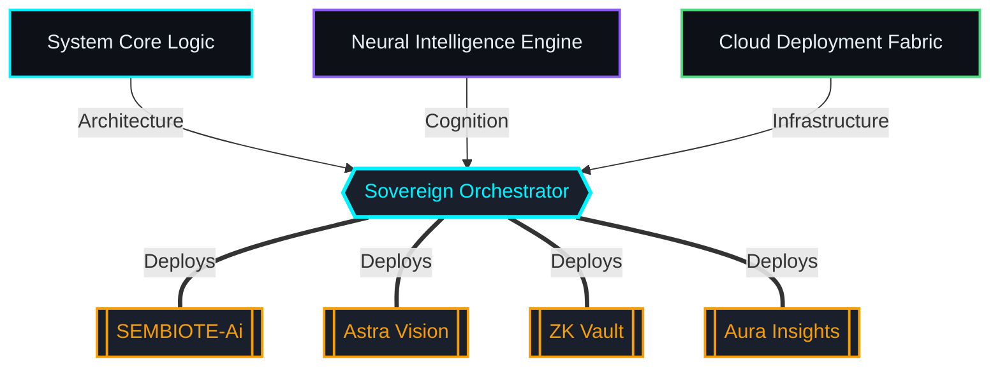
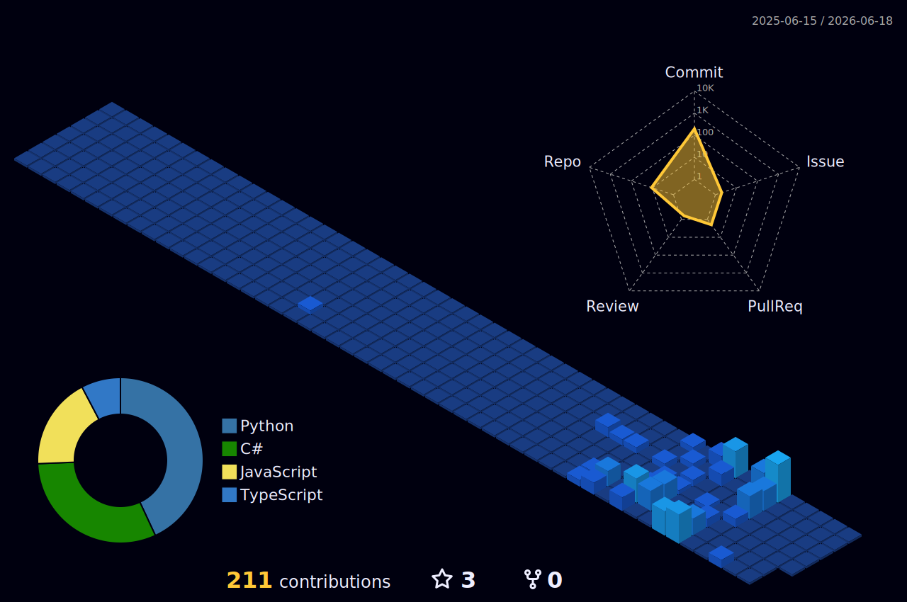

<!-- ═══════════════════════════════════════════════════════════════════════════
     ASTREON — GITHUB PROFILE README
     Design: Sovereign Dashboard v2.0
     Palette: #00F2FF (Neon Cyan) | #8B5CF6 (Electric Violet) | #0D1117 (Dark)
     ═══════════════════════════════════════════════════════════════════════════ -->

<!-- ┌─────────────────────────────────────────────────────────────────────┐
     │  SECTION 1 — HEADER                                                 │
     └─────────────────────────────────────────────────────────────────────┘ -->

<div align="center">


<br/>


<br/><br/>

> **WANT TO HIRE ME? RUN THIS IN YOUR TERMINAL:**
> ```bash
> npx hey-astreon
> ```

<br/>


<br/><br/>

<!-- SOCIAL BADGES -->
<a href="https://www.astreon.me/"></a>&nbsp;
<a href="https://www.linkedin.com/in/roushan-kumar-ab4b19250/"></a>&nbsp;
<a href="mailto:roushanraut404@gmail.com"></a>&nbsp;
<a href="https://www.instagram.com/its_astreon"></a>&nbsp;
<a href="https://discord.com/users/its_astreon"></a>

</div>

<br/>

<!-- ┌─────────────────────────────────────────────────────────────────────┐
     │  SECTION 2 — About Me (Full-width, above the grid)        │
     └─────────────────────────────────────────────────────────────────────┘ -->

<details open>
<summary><b> &nbsp; Classified Dossier — <code>terminal/user/astreon.ts</code></b></summary>
<br/>

```typescript
// 🔴 🟡 🟢  terminal/user/astreon.ts

class Astreon implements Developer {
    readonly name        = "Roushan Kumar";
    readonly alias       = "Astreon";
    readonly location    = "India 🇮🇳";
    readonly education   = "BCA CSIT @ Amity University Noida";

    readonly currentFocus = [
        "AI-Powered Systems",
        "Full-Stack Architecture",
        "Low-Level Security Research",
    ];

    readonly expertise = {
        languages:  ["C", "C++", "C#", "Python", "JavaScript", "TypeScript"],
        frontend:   ["Next.js", "React", "Vue"],
        backend:    ["Node.js", ".NET", "FastAPI"],
        ai_ml:      ["Gemini API", "LangChain", "OpenAI"],
        cloud:      ["AWS", "Azure", "Docker"],
    };

    readonly philosophy = "Build what others say is impossible.";
    readonly status     = "Turning caffeine into sovereign systems";
}
```

</details>

<br/>

<!-- ┌─────────────────────────────────────────────────────────────────────┐
     │  SECTION 3 — TELEMETRY & OPERATIONS (Responsive Stack)              │
     └─────────────────────────────────────────────────────────────────────┘ -->

<div align="center">


<br/><br/>

<div align="center">

&nbsp;&nbsp;

</div>

<br/><br/>
<br/>

<!-- TERMINAL BLOCK 1 -->

<br/>


<br/><br/>

<!-- TERMINAL BLOCK 2 -->

<br/>


<br/><br/>

<!-- TERMINAL BLOCK 3 -->

<br/>
&nbsp;
&nbsp;
&nbsp;

<br/>
&nbsp;
&nbsp;
&nbsp;

<br/><br/>

<!-- TERMINAL BLOCK 4 -->

<br/>


<br/><br/><br/>


<br/>

<div align="center">

<b> Active Operations</b>
<br/><br/>

</div>

<div align="left">

> ### [🛸 SEMBIOTE-Ai](https://github.com/Hey-Astreon/SEMBIOTE-Ai)
> **Stack:** `C#` `.NET` &nbsp;&nbsp;|&nbsp;&nbsp; **Status:** 
> 
> *The core mutualistic bridge for secure intelligence extraction.*

> ### [🔭 Astra Vision](https://github.com/Hey-Astreon/Astra-Vision)
> **Stack:** `JS` `AI` &nbsp;&nbsp;|&nbsp;&nbsp; **Status:** 
> 
> *Next-generation visual perception and processing engine.*

> ### [🔐 ZK Password Vault](https://github.com/Hey-Astreon/Zero-Knowledge-Password-Manager)
> **Stack:** `Crypto` `Auth` &nbsp;&nbsp;|&nbsp;&nbsp; **Status:** 
> 
> *Absolute zero-knowledge cryptographic credential management.*

> ### [📚 Aura Insights](https://github.com/Hey-Astreon/Aura-Insights-AI-Book-Intelligence)
> **Stack:** `Python` `AI` &nbsp;&nbsp;|&nbsp;&nbsp; **Status:** 
> 
> *Neural intelligence layer for literary data extraction.*

</div>

<br/>

<div align="center">
<b> Sovereign Architecture Blueprint</b>
<br/><br/>
</div>



<br/>

<!-- ┌─────────────────────────────────────────────────────────────────────┐
     │  SECTION 5 — SYSTEM AUDIT LOG                                       │
     └─────────────────────────────────────────────────────────────────────┘ -->


<br/><br/>

<div align="left">

<!-- START_AUDIT_LOG -->
**`>_ SYSTEM_LAST_AUDITED: 2026-07-02 02:06:19 UTC`**

### 📡 Intelligence Feed — Recent Extractions:

*- System idle. Monitoring background network traffic...*

<!-- END_AUDIT_LOG -->

</div>

<br/><br/>

<!-- SECTION 5 — MACRO ARCHITECTURE -->
<div align="center">
  <h3>🏙️ MACRO ARCHITECTURE — 3D SKYLINE</h3>
  
  <br/>
  
  
  <br/>
  
</div>

<br/>

<!-- ┌─────────────────────────────────────────────────────────────────────┐
     │  SECTION 6 — GLOBAL METRICS                                          │
     └─────────────────────────────────────────────────────────────────────┘ -->

<div align="center">


<br/><br/>

<div align="center">
  
</div>

<br/>

<!-- FOOTER LOG -->


<br/><br/>

<div align="center">
<h3> Engineered with precision. Deployed with purpose.</h3>
<p><i>"Build what others say is impossible."</i></p>
</div>

<div align="center">
  <a href="https://github.com/Hey-Astreon/Hey-Astreon/issues/new?title=SECURE_TRANSMISSION&body=%3E_INITIATING_COMMUNICATION...%0A%0A%5B+TYPE_YOUR_MESSAGE_HERE+%5D">
    
  </a>
</div>

<br/>

<!-- START_TRANSMISSIONS -->
> **`[2026-05-12]`** **`Hey-Astreon`**: Intelligence processed. The ghost in the machine is watching.
>
>
>
>
<!-- END_TRANSMISSIONS -->

<br/>

<!-- START_AUDIT_LOG -->
<!-- END_AUDIT_LOG -->

<br/><br/>

<!-- PURE LIQUID WAVE ANCHOR -->


<br/><br/>


</div>
